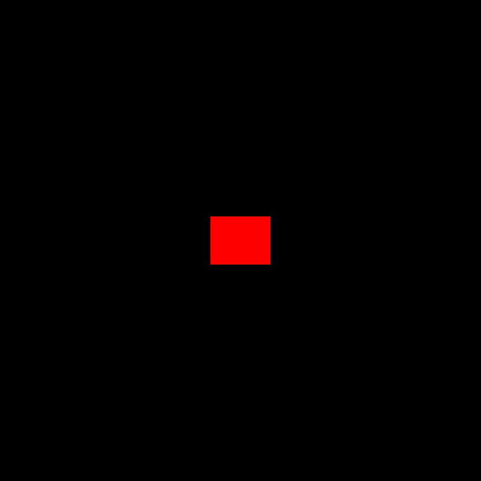
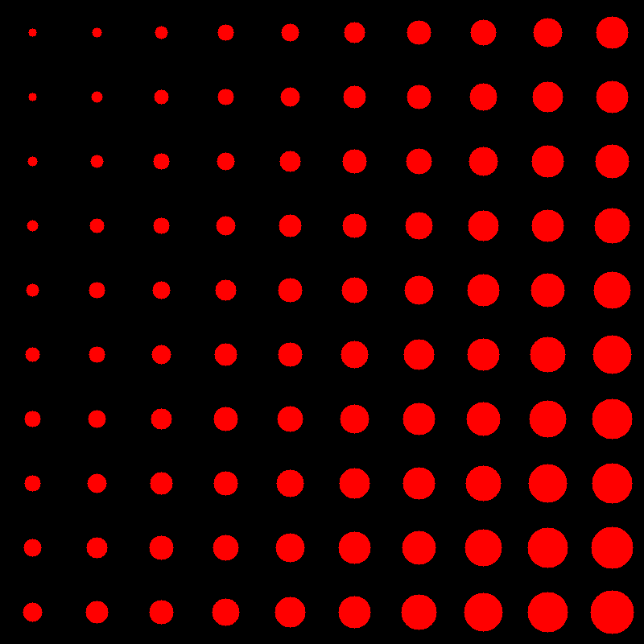
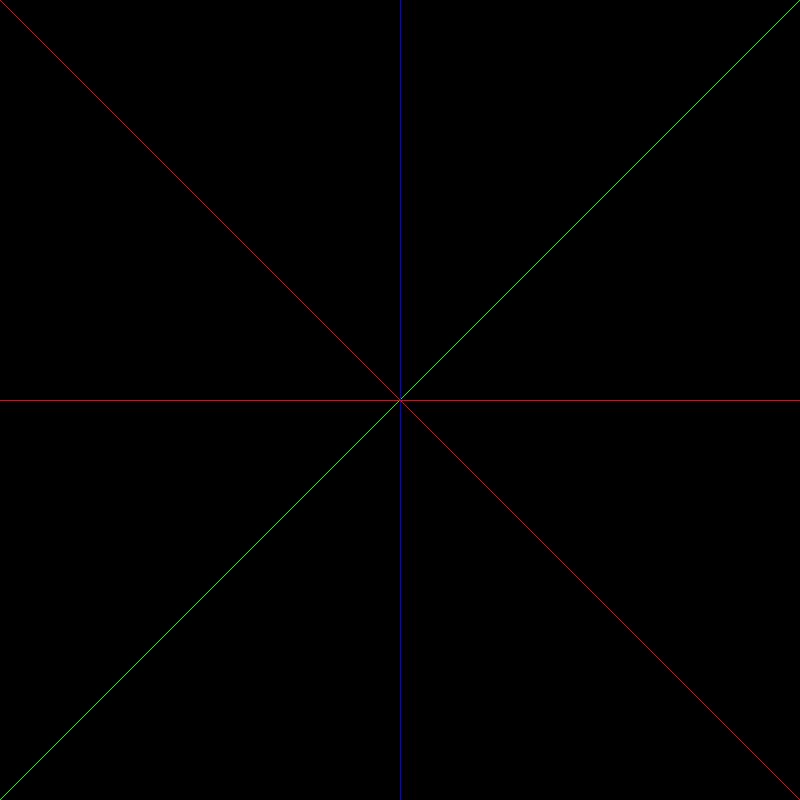

# SGL Draw (Simple Graphics Library)

一个轻量级、面向像素的高效单文件 C 语言图形渲染库。本项目专注于提供基础图形（如矩形、圆形、直线等）的底层像素绘制实现，不依赖任何第三方重量级图形框架，适合学习计算机图形学底层原理或在嵌入式、微型画布系统中使用。

---

## 🎨 渲染效果展示 (Outputs)

以下是运行示例程序后，在 `./output/` 目录下生成的 PPM 格式画布图像（为了在网页上获得最佳兼容性，推荐将其转换为 PNG/JPG 查看）：

### 1. 基础矩形绘制 (`rect_ex.ppm`)

*文件路径: `./output/rect_ex.ppm`*

### 2. 斜向渐变放大圆 (`circle_ex.ppm`)

*文件路径: `./output/circle_ex.ppm`*

### 3. 斜向渐变放大圆 (`line_ex.ppm`)

*文件路径: `./output/line_ex.ppm`*

---

## 🚀 核心特性

- 没啥特别

---

## 🛠️ 快速开始

### 1. 编译运行示例

你可以通过定义宏 `TEST_RECT` 或 `TEST_CIRCLE` 来切换编译不同的测试场景。：

```bash
# 编译测试
gcc ./nob.c -o nob
./nob

# 运行程序
./go
